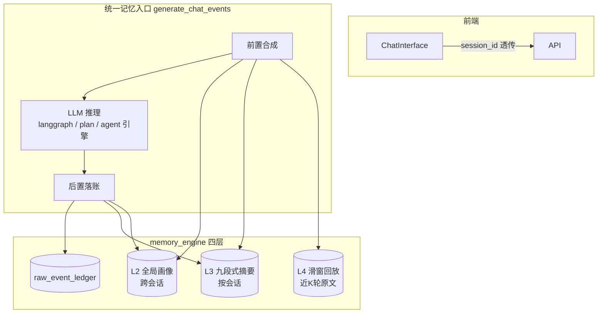

# 非 Code 模式统一上下文记忆机制 — 详细实施计划书

> 版本: v1.0 | 日期: 2026-08-07
> 状态: 待审批

---

## 一、执行摘要

### 1.1 现状问题

当前项目记忆系统（`memory_engine.py`）**只服务于 code 模式**。其余 7 种模式（standard / deep / web / research / agent / plan / distributed_plan）**完全没有接入记忆引擎，且连多轮对话历史都不携带**：

| 缺陷 | 影响 | 根因 |
|------|------|------|
| 无跨轮上下文 | 每轮都是无状态独立调用，"接着上面继续"无法理解 | `generate_chat_events` 签名无 session_id，langgraph 输入仅单条消息 |
| 无用户画像 | 无法记住用户偏好/个性化信息 | L2 档案卡未在非 code 链路注入 |
| 无长对话压缩 | 对话一长就超限或细节丢失 | L3 摘要未接入非 code 链路 |
| 无经验沉淀 | 无 Skill | 非 code 无 Skill 沉淀（本次不涉及） |

### 1.2 方案概述

为 7 种非 code 模式引入**统一上下文记忆机制**，复用现有 `memory_engine` 四层模型，但**不复用 VFS**（聊天类无文件变更）。核心是真正实现文档 L4 滑动窗口 + 升级 L3 摘要 + 打通 L2 全局画像。

**核心决策**（已与用户对齐）：
- **L4 真滑窗**：从事件账本回放近 K 轮 user_input/ai_reply 原文注入 LLM
- **L2 跨会话全局**：用户画像跨会话共享（新增全局作用域）
- **L3 九段式增量笔记**：摘要从"一句总结"升级为结构化九段式笔记
- **L3 后台异步**：利用聊天空隙执行增量压缩，不阻塞主线
- **L5 缓存纪律**：不做缓存伪装，改为"输入形状稳定"原则，白捡 DeepSeek 自动前缀缓存
- **覆盖全部 7 种模式**

### 1.3 预期收益

| 指标 | 当前 | 目标 |
|------|------|------|
| 多轮连续性 | 无状态 | 近 K 轮滑窗 + 早期九段式摘要 |
| 用户个性化 | 无 | 跨会话全局画像 |
| 长对话 Token | 全量/超限 | 摘要压缩，稳定预算 |
| 缓存成本 | 未利用 | 前缀稳定，命中价仅 2% |
| 对话体验 | 每轮失忆 | 连贯、可追溯 |

---

## 二、架构设计

### 2.1 统一上下文注入架构



### 2.2 四层落位

| 层 | 存储 | 作用域 | 注入方式 |
|----|------|--------|----------|
| L1 会话元数据 | session_id 透传 | 随会话 | 请求参数 |
| L2 全局画像 | profile_cards（新增全局作用域） | **跨会话全局** | 稳定前缀 |
| L3 九段式摘要 | conversation_summaries（结构升级） | 按会话 | 稳定前缀 |
| L4 滑窗 | raw_event_ledger 回放（无存储） | 按会话 | 动态后缀 |

### 2.3 缓存纪律（替代 L5 缓存伪装）

DeepSeek Context Caching **默认开启**，命中价仅 2%（差 50 倍）。命中关键 = **前缀字节级稳定**。因此注入顺序遵循：

```text
[稳定前缀] L2 画像 + L3 摘要 + system 提示词（固定）
[动态后缀] L4 滑窗历史 + 当前 message（只在尾部追加）
```

**禁止**：中间插入会漂移的临时状态、每轮重排历史、重生成 system 提示词。

---

## 三、详细设计

### 3.1 L2 全局画像（跨会话）

**现有问题**：`profile_cards` 表按 session_id 键控，无法跨会话共享用户偏好。

**方案**：新增全局作用域。最小改动方案——引入 `user_id` 维度，全局作用域用固定 `user_id`（默认 `"global"`，单用户部署）：

```
profile_cards 表新增字段： user_id TEXT NOT NULL DEFAULT 'global'
索引： (user_id, field_key, valid_start)
```

- `update_profile_field(..., scope='global' | 'session')`：scope=global 写 user_id='global'，scope=session 写当前 session_id
- 双时间戳机制不变（打断旧状态 + 开启新区间）
- 合成上下文时：全局卡 + 本会话卡合并

> 决策：本次默认单用户全局共享（user_id='global'），预留 user_id 列支持未来多用户。前端无用户概念，不做登录改造。

### 3.2 L3 九段式增量笔记（后台异步）

**现有摘要**：`maybe_summarize` 输出一句话 summary_text + topics。

**升级为九段式笔记结构**：

| 段 | 字段 | 来源 |
|----|------|------|
| 1 初始目标 | goal | 会话首轮 user_input 提炼 |
| 2 使用技术 | tech_stack | 对话中出现的技术/工具 |
| 3 变更/关键信息 | key_points | 重要 user_input/ai_reply 摘要 |
| 4 踩坑与解决 | pitfalls | 用户纠错/重新表述 |
| 5 关键指令 | key_instructions | 明确的指令性语句 |
| 6 未完成事项 | open_items | 待办/悬而未决 |
| 7 当前状态 | current_state | 最近状态快照 |
| 8 下一步计划 | next_plan | **一字不差引用用户原话**（防语义偏差） |
| 9 摘要正文 | summary_text | 九段式聚合的正文 |

**后台异步执行**：
- 保留 `maybe_summarize` 的增量游标 `covered`/`turn_end`（天然是"绘画记忆"增量断点）
- 聊天空隙/后置阶段触发，**不阻塞主线**（与 code 模式 `_record_patch_success` 同风格的 best-effort）
- LLM 压缩失败 3 次重试 → 降级截断（沿用 R1 容错）

### 3.3 L4 真滑窗（双写方案）

**对齐文档**：文档 L4 为 LangGraph 消息队列（内存 FIFO）。采用**双写方案**——内存 FIFO 为主（对齐文档语义、零 IO 低延迟），事件账本回放为兜底（刷新/跨会话可恢复）。

**主路径：内存 FIFO 滑窗**
- 会话内维护 `deque(maxlen=K)`，按轮压入 `HumanMessage`/`AIMessage`
- 每轮结束同步写事件账本（保证可恢复）
- 注入：直接取 `deque` 中的消息列表（旧→新）

**兜底路径：账本回放**
- 新增 `get_chat_window(session_id, k)`：从 raw_event_ledger 回放最近 K 轮 `user_input`/`ai_reply` **配对**（非单条事件）
- 会话重启/跨会话/内存清空时，从账本重建 FIFO
- 按时间升序输出（符合缓存纪律：旧→新，仅尾部追加）

**注入一致性**：两条路径产出完全相同的消息形状（K 轮配对、升序），仅数据来源不同，保证缓存纪律不受影响。

**聊天专用阈值**（与 code 模式参数分离，抽配置）：

| 参数 | code 默认 | 聊天默认 | 说明 |
|------|-----------|----------|------|
| 摘要触发轮数 | 8 轮 | 5 轮 | 聊天轮次快 |
| 摘要触发 token | 6000 | 4000 | 聊天内容短 |
| 滑窗 K | 6 | 6-10（可配） | 连贯性 |
| 事件保留 | 500 | 800 | 聊天事件多 |
| 摘要保留 | 20 | 20 | 不变 |

### 3.4 各模式接入点

| 模式 | 入口函数 | 落账粒度 |
|------|----------|----------|
| standard/deep/web/research | `generate_chat_events` | user_input + ai_reply |
| plan | `generate_plan_execute_events` | user_input + 最终 plan/执行结果 |
| distributed_plan | `generate_plan_execute_events(execution_mode='distributed')` | 同上 |
| agent | `generate_multi_agent_events` | user_input + 最终 final_answer（**不记内部 agent_talk**，保 L4 纯度） |

**统一流程**：
1. 前置：合成 L2+L3+L4 上下文 → 注入 LLM
2. `record_event(sid, "user_input", ...)`
3. 后置：`record_event(sid, "ai_reply", ...)` + 异步 `maybe_summarize(sid)` + 画像更新

---

## 四、任务分解

### T1 后端：L2 全局画像
- `memory_engine.py`：profile_cards 加 user_id 列（迁移）、`update_profile_field`/`get_current_profile` 支持 scope
- 测试：全局卡跨会话共享、双时间戳不变

### T2 后端：L4 真滑窗（双写）
- `memory_engine.py`：新增 `get_chat_window(session_id, k)`（轮配对回放，兜底路径）
- 会话运行时：内存 `deque(maxlen=K)` FIFO（主路径），每轮结束同步写账本
- 会话重启/跨会话：从账本重建 FIFO
- 测试：轮配对、升序、K 值截断、内存与账本一致性

### T3 后端：L3 九段式笔记 + 聊天阈值
- `memory_engine.py`：摘要结构升级为九段式、聊天阈值配置化、`_build_summary_digest` 增强
- 测试：九段式字段完整、next_plan 原话引用、阈值切换

### T4 后端：后台异步 + 统一入口
- `main.py`：`generate_chat_events` 加 session_id、前置合成 + 后置落账
- `App.py`：plan/agent 引擎注入
- 测试：路由集成、best-effort 不阻塞

### T5 前端：session_id 透传
- 确认非 code 会话 `activeSessionId` 已写 localStorage；补齐透传

### T6 验证
- pytest 全绿 + tsc --noEmit

---

## 五、风险与约束

| 风险 | 等级 | 缓解 |
|------|------|------|
| L2 全局作用域迁移破坏既有表 | 中 | user_id 列默认 'global'，向后兼容 |
| 后台异步与 SQLite 并发写 | 中 | 单写连接/事务，沿用现有模式 |
| agent 内部讨论误入账本污染 L4 | 中 | 仅记 final_answer，明确不记 agent_talk |
| L4 双写不一致（内存与账本漂移） | 中 | 内存为主、账本兜底；重启时全量重建，账本为唯一真源 |
| 缓存纪律被破坏 | 低 | 注入顺序固化 + 代码 review 约束 |
| 前端 session_id 缺失 | 低 | 前端补齐，缺失时优雅降级为空上下文 |

---

## 六、非本次范围

- L1 文件缩略（属 code 模式 VFS，后续独立任务）
- L5 缓存伪装（调研确认 DeepSeek 自动缓存无需伪装）
- Skill 沉淀（code 模式专属，非 code 无程序性任务）
- 多用户登录/身份体系（仅预留 user_id 列）
