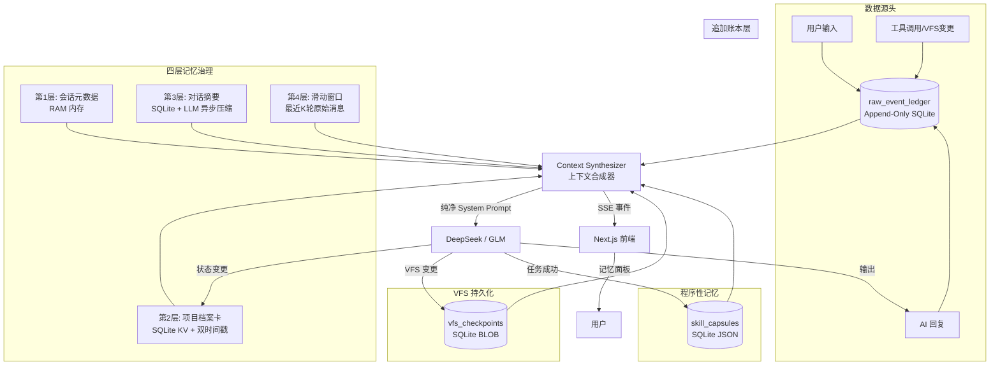
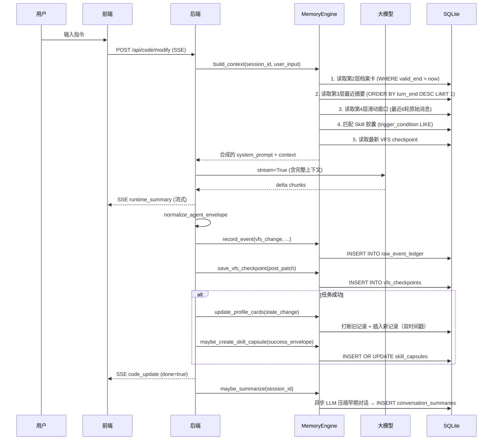
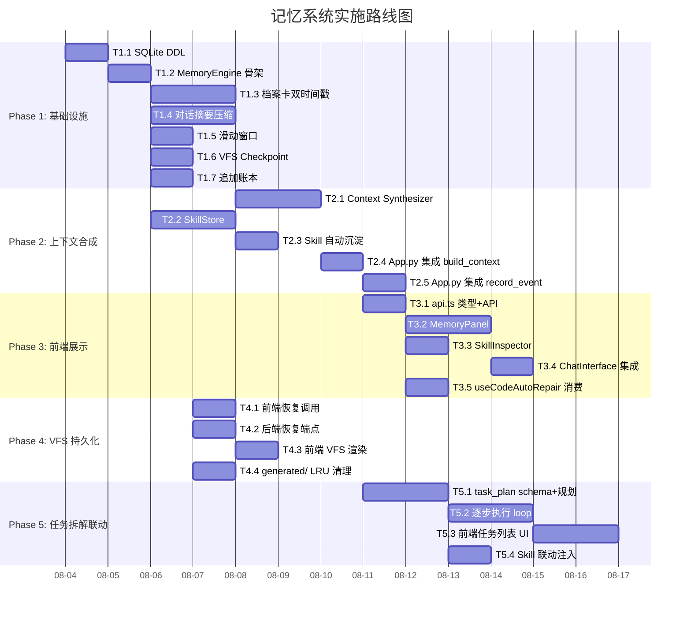

# 生产级 Agent 记忆系统 — 详细实施计划书

> 版本: v1.0 | 日期: 2026-08-03
> 状态: 待审批

---

## 一、执行摘要

### 1.1 现状问题

当前项目在记忆机制上存在 **3 个结构性缺陷**：

| 缺陷 | 影响 | 根因 |
|------|------|------|
| VFS 无持久化 | 页面刷新即丢失全部代码，无法跨会话恢复 | VFS 仅存在于 SSE 请求的局部变量中 |
| 无跨会话记忆 | 模型每次从零开始，不记得上次做了什么 | session_snapshots 存 UI 快照而非 Agent 工作记忆 |
| 无经验沉淀 | 相同类型的任务每次重新规划，成功率不稳定 | 无 Skill/模板库，每次 zero-shot |

### 1.2 方案概述

引入 **四层记忆 + Skill 胶囊 + 追加账本** 架构，在现有 SQLite 基础上扩展 4 张新表，新增 2 个后端模块，前端新增 1 个记忆面板组件。

**核心决策**：
- 复用现有 SQLite（`data/agent_memory.db`），不引入 Redis/向量数据库
- 第 2 层档案卡从"用户画像"改为"项目画像 + 用户编码偏好"
- Skill 胶囊 = 代码生成模式（补丁模板 + 文件结构模板）
- VFS checkpoint 存入 SQLite，解决持久化痛点

### 1.3 预期收益

| 指标 | 当前 | 目标 |
|------|------|------|
| 跨会话 VFS 恢复 | 不支持 | 100% 恢复到最后 checkpoint |
| 长对话 Token 消耗 | 全量原始消息 | 降低 60-80%（摘要替代） |
| 同类任务成功率 | 不稳定（zero-shot） | 提升 30%+（Skill 复用） |
| 审计追溯能力 | 仅 UI 快照 | 完整事件账本 + 状态变更链 |

---

## 二、架构设计

### 2.1 整体架构



### 2.2 SQLite 表结构扩展

在现有 `data/agent_memory.db` 中新增 4 张表：

```sql
-- ============================================================
-- 表 1: 追加账本（所有事件的原始记录，永不删除）
-- ============================================================
CREATE TABLE IF NOT EXISTS raw_event_ledger (
    event_id     INTEGER PRIMARY KEY AUTOINCREMENT,
    session_id   TEXT NOT NULL,
    event_type   TEXT NOT NULL,  -- user_input | ai_reply | tool_call | vfs_change | state_change | error
    event_data   TEXT NOT NULL,  -- JSON payload
    created_at   REAL NOT NULL,  -- unix timestamp
    FOREIGN KEY (session_id) REFERENCES sessions(session_id) ON DELETE CASCADE
);
CREATE INDEX IF NOT EXISTS idx_ledger_session_time
    ON raw_event_ledger(session_id, created_at DESC);

-- ============================================================
-- 表 2: 项目档案卡（双时间戳时序治理）
-- ============================================================
CREATE TABLE IF NOT EXISTS profile_cards (
    card_id      INTEGER PRIMARY KEY AUTOINCREMENT,
    session_id   TEXT NOT NULL,
    field_key    TEXT NOT NULL,  -- e.g. "tech_stack", "user_preference", "api_convention"
    field_value  TEXT NOT NULL,  -- JSON value
    valid_start  REAL NOT NULL,  -- 生效时间
    valid_end    REAL NOT NULL DEFAULT 9999999999.0,  -- 失效时间（远未来=当前生效）
    source       TEXT DEFAULT 'inferred',  -- inferred | explicit | skill_derived
    FOREIGN KEY (session_id) REFERENCES sessions(session_id) ON DELETE CASCADE
);
CREATE INDEX IF NOT EXISTS idx_profile_session_key_time
    ON profile_cards(session_id, field_key, valid_start DESC);

-- ============================================================
-- 表 3: 对话摘要（异步 LLM 压缩）
-- ============================================================
CREATE TABLE IF NOT EXISTS conversation_summaries (
    summary_id   INTEGER PRIMARY KEY AUTOINCREMENT,
    session_id   TEXT NOT NULL,
    turn_start   INTEGER NOT NULL,  -- 覆盖的消息起始序号
    turn_end     INTEGER NOT NULL,  -- 覆盖的消息结束序号
    summary_text TEXT NOT NULL,     -- LLM 压缩后的结构化摘要
    topics       TEXT DEFAULT '[]', -- JSON array of topic strings
    created_at   REAL NOT NULL,
    FOREIGN KEY (session_id) REFERENCES sessions(session_id) ON DELETE CASCADE
);
CREATE INDEX IF NOT EXISTS idx_summary_session_turns
    ON conversation_summaries(session_id, turn_end DESC);

-- ============================================================
-- 表 4: VFS Checkpoint（虚拟文件系统持久化）
-- ============================================================
CREATE TABLE IF NOT EXISTS vfs_checkpoints (
    checkpoint_id INTEGER PRIMARY KEY AUTOINCREMENT,
    session_id    TEXT NOT NULL,
    run_id        TEXT NOT NULL,
    vfs_json      TEXT NOT NULL,   -- 完整 VFS 的 JSON 序列化
    trigger_reason TEXT DEFAULT 'manual',  -- manual | auto | pre_patch | post_patch
    created_at    REAL NOT NULL,
    FOREIGN KEY (session_id) REFERENCES sessions(session_id) ON DELETE CASCADE
);
CREATE INDEX IF NOT EXISTS idx_vfs_session_time
    ON vfs_checkpoints(session_id, created_at DESC);

-- ============================================================
-- 表 5: Skill 胶囊（程序性记忆）
-- ============================================================
CREATE TABLE IF NOT EXISTS skill_capsules (
    skill_id     INTEGER PRIMARY KEY AUTOINCREMENT,
    skill_name   TEXT NOT NULL UNIQUE,
    skill_type   TEXT NOT NULL,  -- code_pattern | task_flow | fix_template
    trigger_condition TEXT NOT NULL,  -- 触发条件描述（LLM 匹配）
    standard_steps   TEXT NOT NULL,   -- JSON array of step descriptions
    required_params  TEXT DEFAULT '[]',  -- JSON array of param names
    validation_rules TEXT DEFAULT '[]',  -- JSON array of rule descriptions
    success_count INTEGER DEFAULT 0,    -- 成功执行次数
    failure_count INTEGER DEFAULT 0,    -- 失败次数
    sample_envelope TEXT,               -- 成功的 envelope 样本（JSON）
    created_at   REAL NOT NULL,
    updated_at   REAL NOT NULL
);
```

### 2.3 数据流转生命周期



---

## 三、模块划分

### 3.1 后端新增模块

| 模块 | 文件 | 职责 | 依赖 |
|------|------|------|------|
| **MemoryEngine** | `memory_engine.py` | 四层记忆管理 + 上下文合成器 + 双时间戳更新 | session_memory.py, SQLite |
| **SkillStore** | `skill_store.py` | Skill 胶囊 CRUD + 触发匹配 + 成功/失败计数 | SQLite |
| **VFSCheckpoint** | `vfs_checkpoint.py` | VFS 序列化/反序列化 + 自动 checkpoint 策略 | SQLite |

### 3.2 后端修改模块

| 模块 | 文件 | 改动点 |
|------|------|--------|
| **App.py** | `App.py` | stream 函数调用 MemoryEngine.build_context()；patch 成功后调用 record_event + save_vfs_checkpoint + update_profile + maybe_create_skill |
| **main.py** | `main.py` | 启动时初始化 MemoryEngine；新增 `/api/memory/profile` 和 `/api/memory/skills` REST 端点 |
| **session_memory.py** | `session_memory.py` | 新增 4 张表的 DDL；SessionStore 构造函数中自动建表 |

### 3.3 前端新增组件

| 组件 | 文件 | 职责 |
|------|------|------|
| **MemoryPanel** | `components/MemoryPanel.tsx` | 展示当前会话的档案卡、摘要、VFS checkpoint 列表、Skill 匹配状态 |
| **SkillInspector** | `components/SkillInspector.tsx` | 展示已沉淀的 Skill 胶囊列表，支持查看标准步骤/参数/校验规则 |

### 3.4 前端修改

| 模块 | 文件 | 改动点 |
|------|------|--------|
| **ChatInterface.tsx** | `components/ChatInterface.tsx` | 侧栏新增"记忆"入口按钮，切换到 MemoryPanel |
| **useCodeAutoRepair.ts** | `hooks/useCodeAutoRepair.ts` | consumeAgentEvent 新增 `memory_update` 事件消费，更新前端记忆状态 |
| **api.ts** | `lib/api.ts` | 新增 `MemoryUpdateEvent`、`SkillMatchedEvent` 类型；新增 `getProfileCards()`、`getSkills()` API |

---

## 四、技术栈选择

| 组件 | 选型 | 理由 |
|------|------|------|
| 存储引擎 | SQLite (WAL mode) | 已有基础设施；单机场景足够；WAL 支持并发读写 |
| 摘要生成 | 复用现有 LLM (DeepSeek/GLM) | 无需引入新依赖；异步执行不阻塞主流程 |
| Skill 匹配 | 关键词 + LLM 混合匹配 | 关键词快速过滤 → LLM 精确匹配两阶段，平衡速度与精度 |
| VFS 序列化 | JSON (with zlib compression) | VFS 是扁平 {path: content}，JSON 天然适合；超 1MB 时 zlib 压缩 |
| 前端状态 | React useState + useReducer | 记忆面板状态简单，不需要引入 Zustand |

### 4.1 不选 Redis 的理由

- 项目单机部署，SQLite WAL 已满足并发需求
- Redis 引入运维复杂度（进程管理、持久化配置、内存监控）
- 记忆数据量级在 MB 级，不需要 Redis 的内存级性能

### 4.2 不选向量数据库的理由

- 第 2 层档案卡用 KV 精确查找，**彻底屏蔽向量检索语义噪声**（这是文档的核心设计理念）
- 第 3 层摘要按时间窗口检索，不需要语义相似度
- 第 4 层滑动窗口按序号 FIFO，纯顺序访问
- 向量数据库（Chroma/Pinecone）引入 embedding 依赖 + 维护成本，收益为零

---

## 五、决策分析

### 5.1 摘要触发策略

| 方案 | 优点 | 缺点 | 推荐 |
|------|------|------|------|
| A. 每 N 轮自动触发 | 简单可控 | 可能 mid-conversation 触发，延迟感知 | |
| B. Token 超阈值触发 | 精准控制 Token 预算 | 需要实时 token 计数 | |
| C. 会话结束时异步触发 | 零延迟感知 | 当前会话不受益 | |
| **D. 混合：N=8轮 + Token>6000 双触发** | **兼顾定期清理与突发长对话** | 实现稍复杂 | **✅ 推荐** |

### 5.2 Skill 胶囊创建时机

| 方案 | 优点 | 缺点 | 推荐 |
|------|------|------|------|
| A. 每次成功即创建 | 覆盖率高 | 噪声大，1 次成功可能是偶然 | |
| **B. 同 trigger 连续成功 2 次后自动沉淀** | **统计显著性** | 有 1 次延迟 | **✅ 推荐** |
| C. 用户手动保存 | 零噪声 | 依赖用户主动操作 | |

### 5.3 VFS Checkpoint 频率

| 方案 | 优点 | 缺点 | 推荐 |
|------|------|------|------|
| A. 每次 patch 后 | 恢复精度最高 | 写放大严重 | |
| **B. pre_patch + post_patch + 每 5 轮自动** | **平衡恢复精度与写入开销** | 实现 3 个触发点 | **✅ 推荐** |
| C. 仅会话结束 | 写入开销最小 | 中途崩溃无法恢复 | |

---

## 六、任务分解

### Phase 1: 基础设施层（后端存储 + 数据模型）

| ID | 任务 | 前置 | 复杂度 | 产出 |
|----|------|------|--------|------|
| T1.1 | SQLite DDL: 4 张新表 + 索引 | 无 | 低 | session_memory.py 新增 `_initialize_memory_tables()` |
| T1.2 | MemoryEngine 类骨架: 初始化 + DB 连接池 | T1.1 | 低 | memory_engine.py |
| T1.3 | 第 2 层档案卡: CRUD + 双时间戳更新逻辑 | T1.2 | 中 | `update_profile_field()`, `get_valid_profile()` |
| T1.4 | 第 3 层摘要: 异步 LLM 压缩 + 存储 | T1.2 | 中 | `summarize_conversation()`, `get_recent_summary()` |
| T1.5 | 第 4 层滑动窗口: FIFO 消息管理 | T1.2 | 低 | `get_sliding_window()` |
| T1.6 | VFS Checkpoint: 序列化 + 存储 + 恢复 | T1.2 | 中 | `save_vfs_checkpoint()`, `restore_vfs()` |
| T1.7 | 追加账本: event 记录 + 查询 | T1.2 | 低 | `record_event()`, `query_events()` |

**Definition of Done**: `pytest tests/test_memory_engine.py` 全部通过，覆盖双时间戳打断/恢复、摘要压缩、VFS checkpoint 往返。

### Phase 2: 上下文合成器（核心逻辑）

| ID | 任务 | 前置 | 复杂度 | 产出 |
|----|------|------|--------|------|
| T2.1 | Context Synthesizer: 合成 4 层 + Skill 为 system_prompt | T1.3-T1.7 | 高 | `build_context()` 返回 `str` |
| T2.2 | SkillStore: CRUD + 触发匹配引擎 | T1.2 | 中 | skill_store.py |
| T2.3 | Skill 自动沉淀: 连续 2 次成功后创建胶囊 | T2.2 | 中 | `maybe_create_skill()` |
| T2.4 | App.py 集成: stream 函数调用 build_context() | T2.1 | 中 | 修改 fix/modify/fullstack stream |
| T2.5 | App.py 集成: patch 成功后调用 record_event + update_profile | T2.4 | 中 | 修改 7 个 patch 入口 |

**Definition of Done**: 手动测试——同会话第 2 次修改时，system_prompt 包含第 1 次的档案卡和摘要；Skill 匹配命中时 SSE 推送 `skill_matched` 事件。

### Phase 3: 前端展示层

| ID | 任务 | 前置 | 复杂度 | 产出 |
|----|------|------|--------|------|
| T3.1 | api.ts 新增类型 + REST API | T2.4 | 低 | `MemoryUpdateEvent`, `getProfileCards()` |
| T3.2 | MemoryPanel 组件: 档案卡 + 摘要 + VFS 列表 | T3.1 | 中 | components/MemoryPanel.tsx |
| T3.3 | SkillInspector 组件: Skill 列表 + 详情 | T3.1 | 中 | components/SkillInspector.tsx |
| T3.4 | ChatInterface 集成: 侧栏新增记忆入口 | T3.2 | 低 | 修改 ChatInterface.tsx |
| T3.5 | useCodeAutoRepair: 消费 memory_update 事件 | T3.1 | 低 | 修改 consumeAgentEvent |

**Definition of Done**: 前端记忆面板正确显示当前会话的档案卡、摘要、VFS checkpoint 数量；Skill 列表可查看；`tsc --noEmit` 通过。

### Phase 4: VFS 持久化 & 跨会话恢复

| ID | 任务 | 前置 | 复杂度 | 产出 |
|----|------|------|--------|------|
| T4.1 | 前端: 页面加载时调用 `/api/memory/vfs/restore` | T1.6 | 中 | 修改 ChatInterface.tsx |
| T4.2 | 后端: `/api/memory/vfs/restore/{session_id}` 端点 | T1.6 | 低 | 修改 main.py |
| T4.3 | 前端: VFS 恢复后自动渲染到 CodeWorkspace | T4.1 | 中 | 修改 CodeWorkspace.tsx |
| T4.4 | generated/ 目录 LRU 清理（保留最近 20 个 run） | T1.6 | 低 | `cleanup_old_runs()` |

**Definition of Done**: 刷新页面后 VFS 从最后 checkpoint 恢复；generated/ 目录不超过 20 个子目录。

### Phase 5: 任务拆解联动（与 Day 58+ 计划合并）

| ID | 任务 | 前置 | 复杂度 | 产出 |
|----|------|------|--------|------|
| T5.1 | 后端: task_plan schema + 规划阶段调用 | T2.1 | 高 | App.py 新增 planning phase |
| T5.2 | 后端: 逐步执行 loop（每子任务独立 patch） | T5.1 | 高 | App.py 新增 execution loop |
| T5.3 | 前端: 任务列表 UI（checkbox + 状态色） | T5.2 | 中 | 修改 CodeWorkspace.tsx |
| T5.4 | Skill 联动: 任务拆解时匹配 Skill 胶囊自动注入 | T5.1, T2.2 | 中 | 修改 build_context() |

**Definition of Done**: 复杂任务自动拆解为 2-6 个子任务，串行执行，前端实时显示任务进度；同类任务第 2 次执行时自动匹配 Skill 胶囊。

---

## 七、风险分析

| # | 风险 | 概率 | 影响 | 缓解策略 |
|---|------|------|------|----------|
| R1 | **摘要 LLM 调用失败** | 中 | 中 | 异步执行 + 3 次重试 + 失败后降级为截断（取前 2000 字符）；不影响主流程 |
| R2 | **双时间戳并发写入冲突** | 低 | 高 | SQLite WAL + `BEGIN IMMEDIATE` 事务；单会话串行写入（同会话不会有并发） |
| R3 | **VFS checkpoint 写放大** | 中 | 中 | 限制 checkpoint 频率（最少间隔 5s）；VFS 超 5MB 时 zlib 压缩；单会话最多保留 10 个 checkpoint |
| R4 | **Skill 胶囊噪声（误匹配）** | 中 | 中 | 触发条件用关键词精确匹配 + LLM 二次确认；success_count < 2 的 Skill 不自动注入，仅展示建议 |
| R5 | **system_prompt 过长（4 层叠加）** | 中 | 高 | Token 预算硬上限：档案卡 500 token + 摘要 800 token + 滑动窗口 2000 token + Skill 500 token = 总计 ≤ 4000 token |
| R6 | **generated/ 目录磁盘占满** | 低 | 高 | LRU 清理保留最近 20 个 run；启动时自动检查 + 日志告警 |
| R7 | **MemoryEngine 与现有 SessionStore 职责重叠** | 中 | 低 | MemoryEngine 只管"Agent 工作记忆"；SessionStore 只管"会话元数据 + UI 快照"；通过 session_id 外键关联，职责不交叉 |

---

## 八、实施路线图



### 里程碑

| 里程碑 | 完成标志 | 交付物 |
|--------|----------|--------|
| **M1: 记忆基础设施可用** | Phase 1 完成 | memory_engine.py + 单元测试通过 |
| **M2: 上下文合成器上线** | Phase 2 完成 | 模型 prompt 包含 4 层记忆 |
| **M3: 前端记忆面板可见** | Phase 3 完成 | 用户可查看档案卡/摘要/Skill |
| **M4: VFS 跨会话恢复** | Phase 4 完成 | 刷新页面不丢代码 |
| **M5: 任务拆解 + Skill 联动** | Phase 5 完成 | 复杂任务自动拆解 + Skill 复用 |

---

## 九、单元测试策略

### 9.1 双时间戳测试（核心）

```python
def test_dual_timestamp_interrupt_and_restore():
    """验证双时间戳打断与恢复：
    1. 写入 field=tech_stack, value=React
    2. 再次写入 field=tech_stack, value=Vue → 打断旧记录
    3. get_valid_profile() 只返回 Vue
    4. query_history() 返回 [React(已失效), Vue(生效中)]
    """
```

### 9.2 VFS Checkpoint 往返测试

```python
def test_vfs_checkpoint_roundtrip():
    """验证 VFS 序列化/反序列化无损：
    1. 构造 VFS dict（含 10 个文件，含中文路径）
    2. save_vfs_checkpoint()
    3. restore_vfs() → 与原 VFS 完全相等
    """
```

### 9.3 上下文合成器 Token 预算测试

```python
def test_context_synthesizer_token_budget():
    """验证合成 prompt 不超 4000 token：
    1. 构造大档案卡（50 个字段）+ 长摘要 + 6 轮长对话
    2. build_context()
    3. assert count_tokens(result) <= 4000
    """
```

### 9.4 Skill 匹配测试

```python
def test_skill_match_and_injection():
    """验证 Skill 胶囊匹配与注入：
    1. 创建 skill: trigger='生成 React 组件', success_count=3
    2. 用户输入 '帮我生成一个按钮组件'
    3. build_context() → system_prompt 包含 Skill 标准步骤
    """
```

---

## 十、接口文档

### 10.1 新增 REST API

| 端点 | 方法 | 请求 | 响应 |
|------|------|------|------|
| `/api/memory/profile/{session_id}` | GET | — | `{"cards": [{field_key, field_value, valid_start, valid_end}]}` |
| `/api/memory/profile/{session_id}` | PUT | `{field_key, field_value}` | `{"card_id": int}` |
| `/api/memory/summary/{session_id}` | GET | — | `{"summaries": [{turn_start, turn_end, summary_text, topics}]}` |
| `/api/memory/vfs/restore/{session_id}` | GET | — | `{"vfs": {path: content}, "checkpoint_id": int}` |
| `/api/memory/vfs/checkpoint/{session_id}` | POST | `{vfs, run_id, trigger_reason}` | `{"checkpoint_id": int}` |
| `/api/memory/skills` | GET | — | `{"skills": [SkillCapsule]}` |
| `/api/memory/skills/{id}` | GET | — | `SkillCapsule` |
| `/api/memory/skills/match` | POST | `{user_input, session_id}` | `{"matched_skills": [SkillCapsule]}` |
| `/api/memory/events/{session_id}` | GET | `?limit=50` | `{"events": [LedgerEvent]}` |

### 10.2 新增 SSE 事件

```typescript
// 记忆系统更新通知（后端→前端）
interface MemoryUpdateEvent {
  type: 'memory_update';
  layer: 'profile' | 'summary' | 'vfs' | 'skill';
  action: 'created' | 'updated' | 'interrupted' | 'restored';
  detail: string;  // 人类可读描述
  done: true;
}

// Skill 匹配命中通知
interface SkillMatchedEvent {
  type: 'skill_matched';
  skill_name: string;
  skill_type: 'code_pattern' | 'task_flow' | 'fix_template';
  confidence: number;  // 0-1
  standard_steps: string[];
  done: true;
}
```

---

## 附录：与现有架构的集成点

| 现有模块 | 集成方式 | 改动量 |
|----------|----------|--------|
| `session_memory.py` SessionStore | 构造函数中调用 `_initialize_memory_tables()` | +15 行 |
| `App.py` stream 函数 | 开头调用 `build_context()`，结尾调用 `record_event()` + `save_vfs_checkpoint()` | 每个函数 +8 行 |
| `main.py` FastAPI | 启动时初始化 `MemoryEngine` + `SkillStore`；新增 9 个 REST 端点 | +60 行 |
| `ChatInterface.tsx` | 侧栏新增记忆入口；加载时调用 VFS restore | +30 行 |
| `useCodeAutoRepair.ts` | `consumeAgentEvent` 新增 2 个事件分支 | +20 行 |
| `api.ts` | 新增 2 个接口类型 + 4 个 API 函数 | +40 行 |

**总改动量估算**：后端 ~400 行新增 + ~50 行修改；前端 ~250 行新增 + ~30 行修改。
