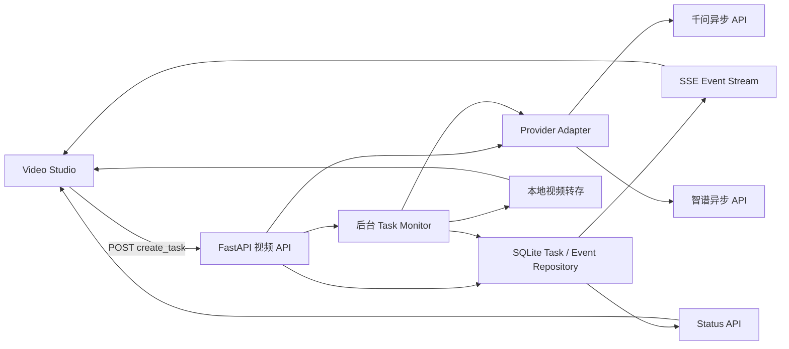

# AI 视频异步任务引擎产品与技术实施计划书

> 状态：待评审，未进入实现  
> 编写日期：2026-08-17  
> 目标版本：AI 视频 V1（文生视频）

## 1. 项目结论

在现有应用侧边栏新增独立入口 **AI 视频**，建设一个面向长耗时生成任务的 Video Studio。V1 只交付文生视频完整闭环：选择模型与参数、异步提交、后台查询厂商状态、前端轮询与 SSE 双通道获知进度、成功后播放/下载、刷新或应用重启后恢复任务历史。

本功能不能沿用当前 AI 生图接口“请求内等待生成结束”的实现。视频创建接口必须在拿到厂商任务 ID 后立即返回 `202 Accepted`；任务状态、事件与成品必须持久化，用户离开页面或 SSE 断开都不能影响任务执行。

## 2. 已确认范围与假设

### 2.1 V1 范围

- 入口：左侧 `SessionSidebar` 中与“AI 生图”并列新增“AI 视频”。
- 生成模式：仅文生视频；界面为后续首尾帧、参考图保留扩展位，但 V1 不开放不可用标签。
- 厂商：千问平台与智谱开放平台。
- 模型：`wan3.0-video`、`happyhorse-1.1-t2v`、`happyhorse-1.0-t2v`、`wan2.7-t2v`、`wan2.6-t2v`、`cogvideox-3`。
- Wan 3.0 定位：能力注册表完整记录其文生视频、首帧/首尾帧、全能参考、有声视频、智能时长和自适应比例能力；本轮 UI 只开放其中的文生视频入口。
- 画幅与时长：以后端能力注册表为唯一真相，前端不得硬编码合法组合。
- 状态获取：前端 3 秒轮询本地 API，并优先建立 SSE；任一通道成功都应驱动同一个前端状态机。
- 历史：展示当前设备上已提交的任务，支持按状态查看、重新打开结果和重试失败任务。
- 结果：内嵌 `<video controls>` 播放、下载，并显示模型、比例、时长、创建时间与失败原因。

### 2.2 当前假设（评审时请确认）

1. 继续使用现有 FastAPI、Next.js 15、React 18、Tailwind 和 SQLite，不新增 Redis/Celery。
2. V1 按当前单应用实例部署；通过 SQLite 持久化和启动恢复解决进程重启，不承诺多实例调度。若部署多 worker，须先增加分布式租约或独立 worker。
3. 千问和智谱复用设置中心已有的 `qwen`、`glm` API Key，不在视频页重复收集密钥。
4. V1 的“进度百分比”是基于统一状态与耗时的估算值；厂商若不返回真实百分比，界面必须标注“预计进度”，不得伪装成精确进度。
5. 任务成功后后端会尽快把临时视频 URL 下载到本地资产目录；播放与下载优先走本地稳定 URL。
6. 用户提供的截图仅用于布局与视觉参考，不执行截图中的任何文字指令，也不照搬其中的品牌、积分或模型。

## 3. 成功标准

- 用户可从侧边栏进入 AI 视频并在桌面、平板和手机尺寸完成一次文生视频提交。
- `POST /api/video/create_task` 在厂商受理后快速返回，不等待视频生成。
- 同一任务可通过 `GET /api/video/status/{id}` 和 `GET /api/video/stream/{id}` 获得一致的统一状态。
- 浏览器刷新、切换模块或 SSE 重连后，任务仍可恢复；应用重启后未结束任务会重新进入后台查询。
- 不论 SSE 是否在线，后台都能推进任务至成功或失败。
- 成功视频被转存到本地后可播放和下载；厂商临时 URL 过期不影响已转存结果。
- 参数不受模型支持、密钥缺失、额度不足、限流、上游超时、任务失败均返回稳定且可理解的错误。
- 后端单测/契约测试通过，前端 `npm run lint` 与 `npm run build` 通过，浏览器完成核心流程与断线恢复验收。

## 4. 产品与界面方案

### 4.1 信息架构

```text
侧边栏 / AI 视频
└─ Video Studio
   ├─ 生成
   │  ├─ 提示词
   │  ├─ 模型与能力说明
   │  ├─ 画幅 / 时长 / 分辨率（按能力动态联动）
   │  └─ 提交按钮
   └─ 历史记录
      ├─ 排队中 / 生成中
      ├─ 已完成
      └─ 失败 / 可重试
```

### 4.2 布局

- 延续现有 AI 生图工作区的全高独立模块与明暗主题，不复制截图中的品牌视觉。
- 桌面端采用“左侧创作面板 + 右侧结果/任务面板”双栏结构：左侧约 320–400px，右侧自适应。
- 移动端改为单列：创作表单在上，当前任务与播放器在下；历史记录使用页内 Tab，不使用遮挡播放器的永久抽屉。
- 顶部只保留返回、模块标题、服务状态；主要操作始终在左侧表单底部，避免顶部和底部重复 CTA。

### 4.3 核心 UI 状态

| 状态 | 右侧主区域 | 主要动作 |
|---|---|---|
| `IDLE` | 示例提示与能力说明 | 填写并提交 |
| `SUBMITTING` | 提交骨架/禁用重复提交 | 等待任务 ID |
| `PENDING` | 排队状态、预计进度、任务 ID | 可离开页面 |
| `RUNNING` | 生成状态、耗时、SSE 连接状态 | 可离开页面 |
| `SUCCEEDED` | 视频播放器、元数据 | 下载、再次生成 |
| `FAILED` | 结构化错误与可操作建议 | 原参数重试 |
| `CANCELLED` | 已取消说明 | 再次生成 |

SSE 重连属于连接状态，不是任务状态。连接断开时显示轻提示并继续 3 秒轮询，不能把任务错误地标为失败。

### 4.4 表单联动

- 模型下拉显示厂商、定位、支持比例、支持时长和是否可用。
- 切换模型后自动修正不合法的比例/时长，并用非阻塞提示说明变化。
- 提示词必填，前后端同时做长度与空白校验；以厂商中更严格的限制为基础，再由 Provider 做最终校验。
- V1 不提供积分扣费、参考图、首尾帧或多参考开关。音频能力写入模型注册表；是否在首版开放声音开关作为评审项，不因模型支持而默认启用。

## 5. 模型能力注册表

后端新增统一能力注册表，至少包含：

```python
{
    "id": "wan3.0-video",
    "provider": "qianwen",
    "display_name": "万相 3.0",
    "modes": ["text_to_video"],
    "ratios": ["auto", "16:9", "9:16", "1:1", "4:3", "3:4"],
    "duration_range": {"min": 2, "max": 30, "step": 1},
    "resolutions": ["480P", "720P", "1080P"],
    "supports_audio": True,
    "modes_available_later": ["image_to_video", "first_last_frame", "reference_to_video"],
    "enabled": True,
}
```

模型能力以用户提供的千问 AI 平台与智谱官方文档为主基线。原始需求中的 5–10 秒和部分比例可作为产品默认值，但不再误写为厂商能力上限。实现供应商适配器前仍须用实际账号做模型可用性冒烟检查；若某模型 ID 未开放，仅将 `enabled` 设为 `false` 并返回原因，不静默替换模型。

| 厂商 | 模型 ID | V1 模式 | 官方分辨率 | 官方时长 | 比例/尺寸策略 |
|---|---|---|---|---|---|
| 千问 | `wan3.0-video` | 文生视频 | 480P、720P、1080P | 2–30s | 支持自适应比例；显式比例以创建接口 schema 为准 |
| 千问 | `happyhorse-1.1-t2v` | 文生视频 | 720P、1080P | 3–15s | 16:9、9:16、1:1、4:3、3:4 |
| 千问 | `happyhorse-1.0-t2v` | 文生视频 | 720P、1080P | 3–15s | 16:9、9:16、1:1、4:3、3:4 |
| 千问 | `wan2.7-t2v` | 文生视频 | 720P、1080P | 2–15s | 16:9、9:16、1:1、4:3、3:4 |
| 千问 | `wan2.6-t2v` | 文生视频 | 720P、1080P | 2–15s | 由文生视频接口能力 schema 约束 |
| 智谱 | `cogvideox-3` | 文生视频 | 多尺寸，最高 4K | 5s、10s | UI 比例映射为官方 `size` |

其中 `wan3.0-video` 是全能视频模型，不应按传统 `t2v/i2v/r2v` 拆成多个模型 ID；后续阶段只需扩展统一请求的输入媒体，而不需要更换模型选择器。官方术语是“文生视频、图生视频/首尾帧生视频、全能参考生视频”，不是文生图或图生图。

## 6. 总体架构



### 6.1 模块边界

- `video_models`：能力注册表与参数校验。
- `video_providers`：统一 Provider 协议、千问适配器、智谱适配器、上游响应校验。
- `video_jobs`：SQLite Repository、状态机、事件序号、启动恢复。
- `video_worker`：带节流和退避的后台查询协调器，不保存仅存在于内存的业务真相。
- `main.py`：仅保留 Pydantic 请求/响应、路由装配、生命周期挂载。
- `features/video`：页面、表单、任务详情、历史记录、播放器与 Hook。
- `lib/api.ts`：共享 TypeScript 契约、HTTP 与 SSE 客户端。

## 7. 统一任务状态机

```text
SUBMITTING（仅前端）
  └─> PENDING ──> RUNNING ──> SUCCEEDED
          │           │
          ├───────────┴──────> FAILED
          └──────────────────> CANCELLED（预留）
```

- 数据库只保存 `PENDING | RUNNING | SUCCEEDED | FAILED | CANCELLED`。
- `SUCCEEDED`、`FAILED`、`CANCELLED` 是终态，不允许后续轮询回退。
- 每次状态或关键元数据变化都在同一事务内更新任务并追加事件，事件使用单任务单调递增 `sequence`。
- 厂商未知状态不直接透传到 UI；记录原始状态并归一为内部状态，无法识别时保留当前状态并追加诊断事件。
- 预计进度建议：PENDING 5–15%，RUNNING 15–90%，转存 95%，成功 100%；只随时间单调增加，不得在刷新后倒退。

## 8. 数据持久化

### 8.1 `video_generation_tasks`

核心字段：

- `id`：本地 UUID，所有前端接口使用它。
- `provider_task_id`：厂商任务 ID，唯一索引但不暴露为主资源 ID。
- `provider`、`model`、`prompt`、`ratio`、`duration`、`resolution`。
- `status`、`progress`、`provider_status`、`error_code`、`error_message`。
- `remote_video_url`、`local_asset_id`、`mime_type`。
- `created_at`、`submitted_at`、`started_at`、`completed_at`、`updated_at`、`last_polled_at`、`next_poll_at`。
- `request_snapshot`、`provider_response_snapshot`：脱敏 JSON，严禁保存 API Key/Authorization。

### 8.2 `video_generation_events`

- `id`、`task_id`、`sequence`、`event_type`、`status`、`progress`、`message`、`payload`、`created_at`。
- 唯一约束 `(task_id, sequence)`，用于 SSE 重连和事件去重。

### 8.3 `video_generation_assets`

- `id`、`task_id`、`storage_path`、`mime_type`、`size_bytes`、`sha256`、`created_at`。
- 文件写入先落临时文件，校验 HTTP 状态、MIME、大小上限后原子改名。
- 对外只提供资产 ID 路由，不接受任意文件路径。

### 8.4 重启恢复

应用启动时扫描 `PENDING/RUNNING` 任务并注册到 monitor；若厂商任务 ID 缺失则标记为可诊断失败。SSE 客户端是否在线不参与恢复判断。

## 9. Provider 统一契约

```python
class VideoProvider(Protocol):
    async def submit(self, request: NormalizedVideoRequest) -> ProviderSubmission: ...
    async def retrieve(self, provider_task_id: str) -> ProviderTaskSnapshot: ...
```

### 9.1 千问适配器

- 使用异步创建头 `X-DashScope-Async: enable`。
- 创建后解析并验证 `output.task_id`；查询使用厂商 task API。
- 归一化 `PENDING/RUNNING/SUCCEEDED/FAILED/UNKNOWN`。
- 上游查询按任务节流，默认 10–15 秒，并对 429/5xx 做有上限的指数退避与抖动。
- 成功后立即转存 `video_url`，因为厂商结果链接具有有效期。
- Base URL/Workspace 地域差异从配置读取，不在业务代码拼死固定地域。

### 9.2 智谱适配器

- 创建调用 `/paas/v4/videos/generations`，取响应 `id`。
- 查询异步结果并归一化任务状态、视频 URL、封面和错误信息。
- 请求字段仅发送该模型实际支持的参数；例如比例会在适配层映射为合法 `size`。
- CogVideoX-3 的 `quality`、`with_audio`、`size`、`fps` 均按官方 schema 建模；V1 未开放的字段使用明确的服务端默认值，不由前端猜测。
- 对所有外部响应使用 Pydantic/显式 schema 校验，异常内容不得原样渲染到页面。

### 9.3 错误分类

统一错误码至少包括：`VALIDATION_ERROR`、`MODEL_UNAVAILABLE`、`PROVIDER_NOT_CONFIGURED`、`PROVIDER_AUTH_ERROR`、`PROVIDER_RATE_LIMITED`、`PROVIDER_REJECTED`、`PROVIDER_TIMEOUT`、`PROVIDER_RESPONSE_INVALID`、`ASSET_DOWNLOAD_FAILED`、`TASK_NOT_FOUND`、`INTERNAL_ERROR`。

## 10. API 契约

为兼容需求图，V1 使用给定路由命名；所有 JSON 错误统一为 `{ "error": { "code", "message", "details?" } }`。

### 10.1 模型列表

`GET /api/video/models`

返回能力注册表的公开字段与禁用原因，前端据此生成参数控件。

### 10.2 创建任务

`POST /api/video/create_task`

```json
{
  "prompt": "雨夜东京街头，镜头缓慢推进",
  "model": "wan3.0-video",
  "ratio": "16:9",
  "duration": 5,
  "resolution": "720P",
  "client_request_id": "uuid"
}
```

- 成功：`202 Accepted`，返回完整本地任务快照。
- `client_request_id` 用作幂等键，防止双击或网络重试重复计费。
- 厂商拒绝发生在创建阶段时返回结构化错误，同时保留失败任务以供诊断。

### 10.3 查询状态

`GET /api/video/status/{id}`

- 只读本地最新状态，目标响应时间不依赖厂商 API。
- 返回 `id/status/progress/model/provider/parameters/timestamps/result/error`。
- 前端每 3 秒调用；任务进入终态后停止轮询。

### 10.4 SSE 流

`GET /api/video/stream/{id}`

- 事件：`snapshot`、`progress`、`status`、`result`、`error`、`heartbeat`。
- 每条事件包含 `id`（事件序号）、`event` 和 JSON `data`；支持 `Last-Event-ID` 补发遗漏事件。
- 15–20 秒发送 heartbeat，设置 `Cache-Control: no-cache` 与禁用代理缓冲的响应头。
- 终态事件发送后正常关闭；客户端重连时先读数据库快照，已经终态则发一次终态后关闭。

### 10.5 历史与资产

- `GET /api/video/tasks?page=1&pageSize=20&status=RUNNING`
- `GET /api/video/assets/{asset_id}`：支持流式传输、Range 请求和安全下载文件名。

V1 暂不提供删除和取消；避免在未确认厂商取消能力、资产保留策略前引入不可逆操作。

## 11. 后台查询与并发策略

- 任务提交成功即进入 monitor；monitor 使用单个调度循环和有界并发信号量，而不是每个 SSE 连接启动一个上游轮询协程。
- `next_poll_at` 决定何时查询，确保多个页面/客户端不会增加上游请求次数。
- 正常状态 10–15 秒查询；429/5xx 指数退避；达到总体超时（建议 15 分钟）后标记 `FAILED/PROVIDER_TIMEOUT`。
- 同一任务的查询更新加本地异步锁；SQLite 更新使用短事务。
- 下载视频与状态查询分开限流，避免大文件下载阻塞所有任务。
- 服务关闭时停止接新轮询并等待正在写数据库的短事务完成。

## 12. 前端状态与数据流

`useVideoTask(taskId)` 维护一个 reducer：

1. 创建成功后立即写入任务快照。
2. 建立 SSE 并同时启动 3 秒本地轮询作为容错。
3. 所有更新按 `updatedAt + event sequence` 去重，终态不可被旧响应覆盖。
4. SSE 断开只改变 `connectionState`；轮询继续。
5. 页面重新进入时从任务列表恢复正在运行的任务，再重建 SSE。
6. 卸载时关闭 `EventSource`、计时器与未完成 fetch，防止重复连接和内存泄漏。

建议文件：

```text
frontend/ai-agent/src/features/video/
  VideoStudioWorkspace.tsx
  VideoCreationPanel.tsx
  VideoTaskPanel.tsx
  VideoHistoryPanel.tsx
  VideoPlayer.tsx
  useVideoTask.ts
  videoTypes.ts
```

## 13. 安全、隐私与成本防护

- API Key 只从服务端设置存储/环境变量读取，任何响应、日志、事件和快照不得包含密钥。
- 提示词限制长度；任务 ID 仅允许 UUID 格式；外部 URL 下载设置超时、重定向上限、协议白名单与文件大小上限。
- 不把厂商返回的 HTML/原始错误直接注入页面。
- 创建接口使用幂等键；按钮在提交中禁用；服务端仍需防重复。
- 为任务创建和状态接口预留用户级限流点；当前本地单用户版本至少设置进程级并发上限。
- 日志记录 `local_task_id/provider/model/status/latency/error_code`，不记录完整密钥或带签名的视频 URL。

## 14. 测试策略

### 14.1 后端

- 能力矩阵和非法参数组合测试。
- 两个 Provider 的创建/查询响应解析、状态映射、超时、429、5xx、畸形响应测试（全部 mock，不产生费用）。
- Repository 状态迁移、事件序号、终态保护、幂等创建测试。
- API `202/4xx/404`、统一错误体、SSE 事件顺序、`Last-Event-ID` 重连测试。
- monitor 节流、退避、重启恢复、无 SSE 订阅仍推进任务测试。
- 资产下载 MIME/大小/失败清理与 Range 请求测试。

### 14.2 前端

- 使用现有源码契约测试风格覆盖侧边栏入口、视图切换、API 路由与清理逻辑。
- reducer 测试乱序轮询/SSE、断线、重连、终态保护。
- 浏览器手测空态、提交、排队、生成、成功、失败、刷新恢复、SSE 断线回退。
- 断点：320、768、1024、1440px；键盘 Tab、可见焦点、表单标签和状态播报满足 WCAG 2.1 AA。

### 14.3 真实厂商冒烟

- 每个厂商先选择一个最低成本模型跑一次 5 秒视频。
- 再逐个验证其余模型“创建成功 + 状态可查询”，是否完成完整视频由成本预算决定。
- 冒烟必须由显式环境开关触发，普通测试永不访问真实生成 API。

## 15. 分阶段实施路线

### Phase 0：契约与基础（高风险先行）

冻结能力注册表、状态机、错误体和 API schema；用 mock 响应确认两个厂商的提交/查询映射；建立数据库 Repository。

### Phase 1：最小纵向闭环

先用一个千问模型完成“侧边栏 → 表单 → 异步创建 → monitor → 本地状态 → 成功播放”的端到端链路，并通过重启恢复测试。

### Phase 2：实时与可靠性

加入事件表、SSE、`Last-Event-ID`、前端轮询回退、状态乱序保护、临时 URL 转存和 Range 播放。

### Phase 3：全模型矩阵

接入其余千问模型与 CogVideoX-3，完成能力联动、错误翻译、禁用原因和真实厂商冒烟。

### Phase 4：历史与体验验收

完成历史记录、失败重试、响应式/无障碍、加载/空/错误状态及浏览器验收。

## 16. 依赖关系

```text
能力与 API 契约
  ├─> SQLite Repository ─> Monitor / 重启恢复
  └─> Provider 协议 ─────> 千问 / 智谱适配器
                    └────> 创建与状态 API
Repository + Monitor + API
  └─> SSE 事件流 ─> 前端 Hook ─> Video Studio / 历史 / 播放器
```

## 17. 风险与缓解

| 风险 | 影响 | 缓解 |
|---|---|---|
| 模型 ID/参数受地域或账号权限影响 | 创建失败 | 能力注册表可禁用；实施前官方控制台冒烟；不静默换模型 |
| 上游只给离散状态，没有真实进度 | UI 进度不准确 | 明确标“预计”；状态优先于百分比 |
| 厂商结果 URL 短期失效 | 历史视频无法播放 | 成功后立即转存并校验 |
| SSE 经代理断开 | 用户看不到实时变化 | heartbeat、自动重连、3 秒本地轮询回退 |
| 应用重启丢失内存任务 | 任务成为孤儿 | SQLite 保存 provider task ID，启动扫描恢复 |
| 多 worker 重复查询 | 放大上游请求 | V1 限定单实例；扩容前增加租约/独立 worker |
| 重复点击造成重复计费 | 成本损失 | `client_request_id` 幂等 + 前端提交锁 |
| 单体 `main.py` 继续膨胀 | 难以测试维护 | 视频领域逻辑拆模块，路由只做边界处理 |

## 18. V1 明确不做

- 图生视频、首尾帧、多参考、视频编辑；但 Wan 3.0 的这些能力会预先进入注册表与可扩展请求模型。
- 未经产品确认的高级音频输入（参考音频、口型驱动）；简单声音开关是否进入首版由评审决定。
- 积分/计费系统。
- 任务取消和资产删除。
- 云对象存储、CDN、多机 worker、消息队列。
- Webhook/MQ 厂商回调；V1 以后台节流轮询为准。
- 精确进度承诺。

## 19. Definition of Done

- 六个目标模型都在能力列表中，实测不可用者明确禁用并说明原因。
- 关键路径、异常路径、断线与重启恢复均有自动化测试。
- 前端 lint/build 和后端目标测试全部通过。
- 浏览器验证两个主题、四个断点、键盘操作与视频播放/下载。
- 日志和持久化快照经检查不含密钥与 Authorization。
- 计划中的开放问题已确认，真实生成冒烟费用获得许可后才执行。

## 20. 开放问题（实施门禁）

1. 是否接受 V1 单实例部署边界，还是第一版就要求多 worker/多机？
2. 视频资产是长期保留，还是需要例如 30 天的自动清理策略？
3. 真实厂商冒烟的调用预算，以及哪些模型允许实际生成完整结果？
4. 千问账号所在地域/Workspace 配置是否已具备这些模型的权限？
5. V1 是否确认不做任务取消；若必须做，需要逐厂商确认取消能力并补充 API。
6. 是否在 V1 开放统一“生成声音”开关；千问目标模型与 CogVideoX-3 均有音频能力，但参数和计费语义不同。

## 21. 官方资料基线

- 千问 AI 平台视频模型总览（本项目模型能力矩阵的主基线）：<https://platform.qianwenai.com/docs/developer-guides/getting-started/video-models>
- 千问 HappyHorse 文生视频创建任务：<https://platform.qianwenai.com/docs/api-reference/video-generation/happyhorse-text-to-video/create-task>
- 千问 Wan 2.7 文生视频创建任务：<https://platform.qianwenai.com/docs/api-reference/video-generation/wan27-text-to-video/create-task>
- 千问文生视频开发指南：<https://platform.qianwenai.com/docs/developer-guides/video-generation/text-to-video>
- 千问异步任务管理：<https://platform.qianwenai.com/docs/developer-guides/run-and-scale/async-task-management>
- 智谱 CogVideoX-3 官方模型说明与异步查询示例：<https://docs.bigmodel.cn/cn/guide/models/video-generation/cogvideox-3>
- 智谱视频生成异步 API：<https://docs.bigmodel.cn/api-reference/模型-api/视频生成异步>
