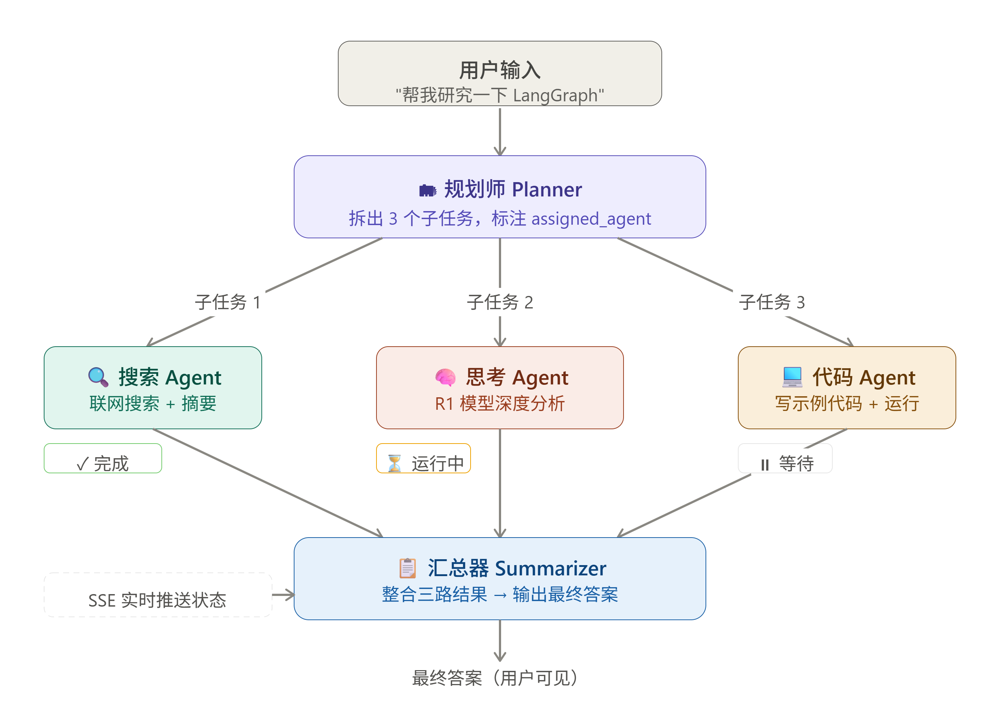
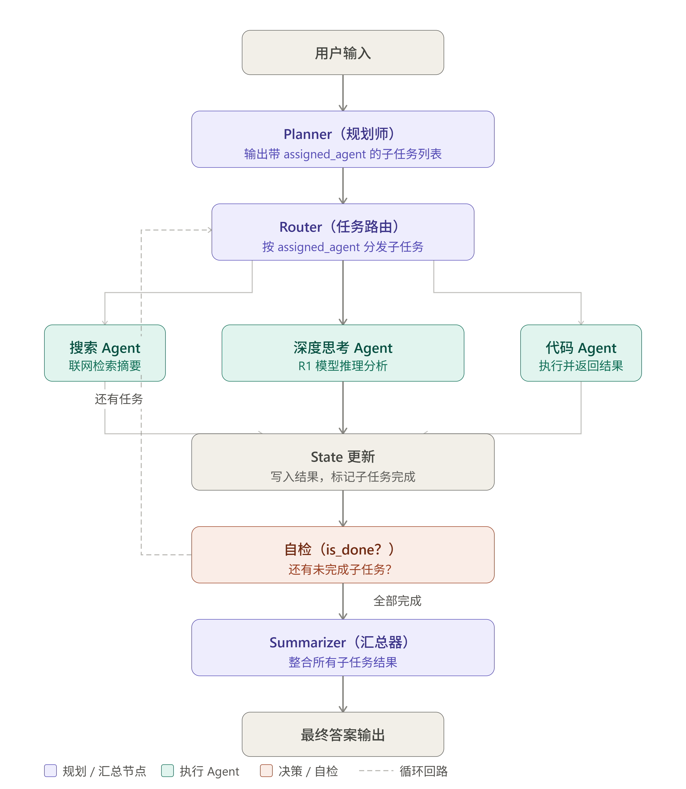
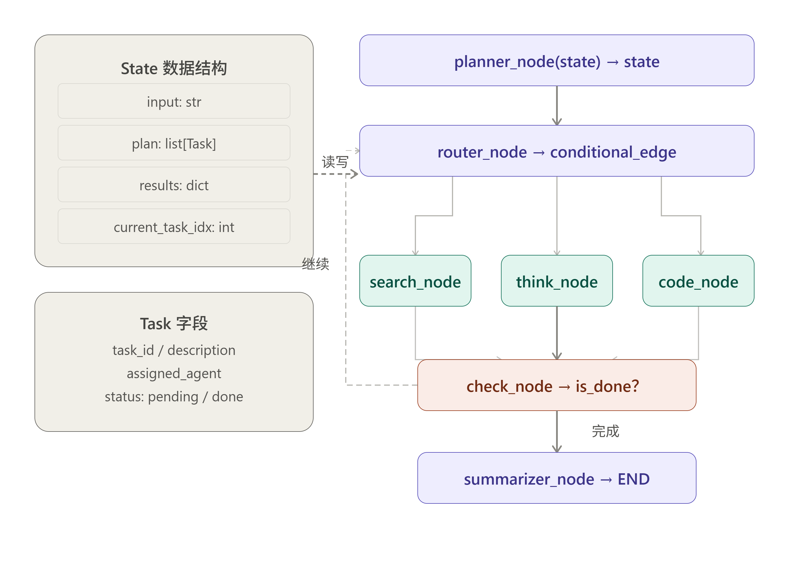
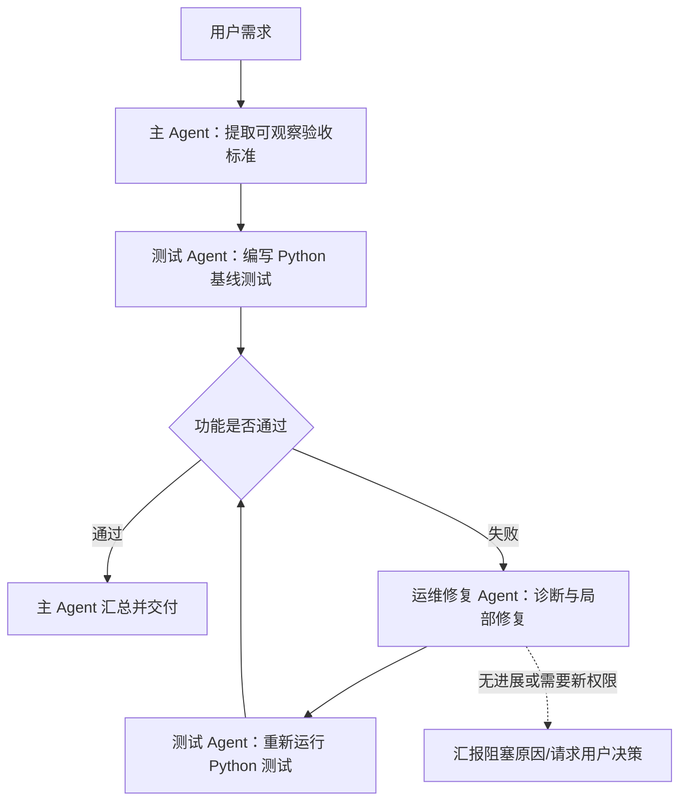
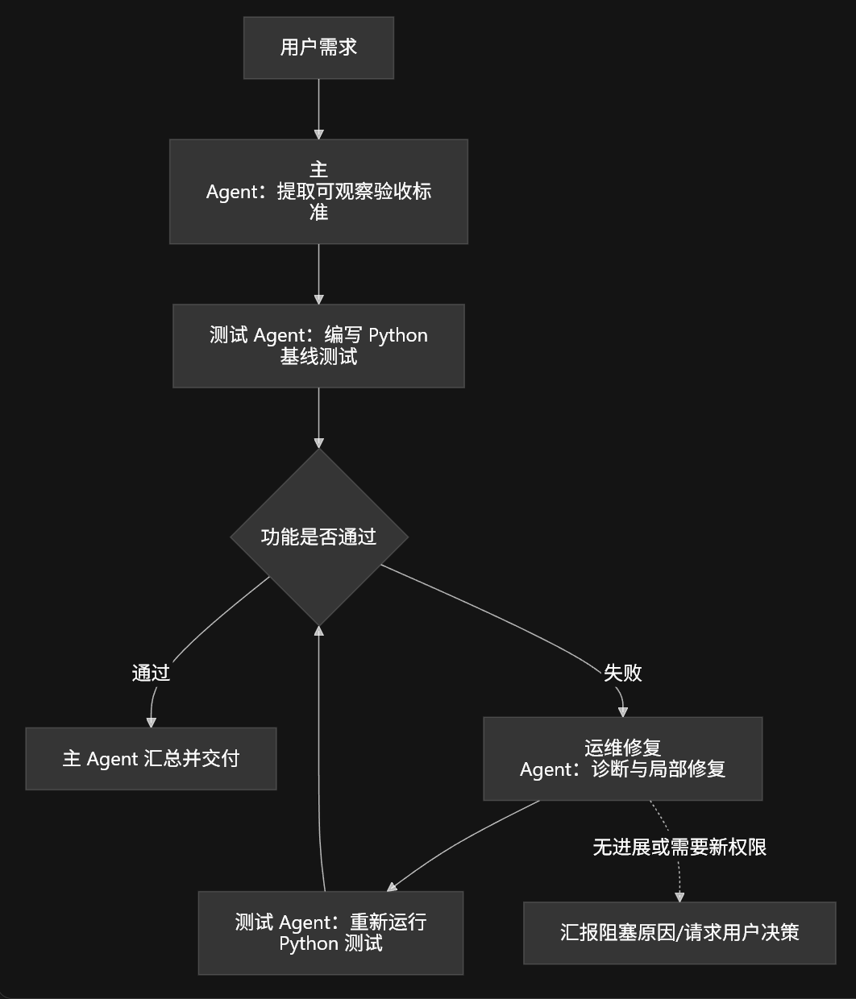

接口文档：http://127.0.0.1:8000/docs#/

单智能体自主任务架构
```text
[用户输入巨型任务]
       │
       ▼
  [Planner 节点] ──► 生成初始 Task List: ["1. 查技术", "2. 查市场", "3. 算财务"]
       │
       ├────────────────────────┐
       ▼                        ▼
[Task Executor 节点]     [前端 UI 实时渲染]
执行当前第一个 Task       (显示 Task 1: 完成 ✅, Task 2: 执行中 ⏳)
       │
       ▼
 [Re-Planner 节点] ──► 检查是否全部完成？
       │                ├─ NO  ──► 更新剩下的 Task List，循环继续
       │                └─ YES ──► 整合所有 Task 成果
       ▼
 [Final Summarizer] ──► 输出总报告
```



Planner → Executor → Re-Planner → Final Summarizer
但这些节点目前都调用同一个模型能力，只是提示词职责不同：
Planner：拆解任务
Executor：逐项完成任务
Re-Planner：根据进展调整待办
Summarizer：汇总最终报告
所以它不是多个独立 Agent 互相协作，而是一个 Agent 在不同阶段切换角色。


多智能体自主任务分发
```text
[用户大目标 (User Goal)]
                          │
                          ▼
            [Planner 节点 (项目经理)]
    拆解生成带 Agent 标签的 Task 清单 (Task Checklist)
                          │
       ┌──────────────────┼──────────────────┐
       ▼                  ▼                  ▼
[Task 1: 联网搜集]   [Task 2: 深度推理]   [Task 3: 数据分析]
   assigned:          assigned:          assigned:
web_search_agent   deep_thinker_agent  data_analyst_agent
       │                  │                  │
       ▼                  ▼                  ▼
 (调用 32天 Tavily)  (调用 33天 R1 思考) (调用 15天 结构解析)
       │                  │                  │
       └──────────────────┼──────────────────┘
                          ▼
             [Re-Planner 检查完成度]
             所有 Task 完成 ➔ [最终汇总]
```




### 一、 整体系统架构与数据流向 (System Architecture)

```text
[ 用户前端 React ]
    │
    ├── 1. 点击 "✨ 智能生成" ──► [ POST /api/agent/generate ] ──► [ LLM Meta-Prompt ]
    │                                                                   │
    │   ┌───────────────────────────────────────────────────────────────┘
    │   ▼ (自动回填 Form 表单: 名称、英文标识、何时调用、Prompt、推荐工具)
    │
    ├── 2. 点击 "保存智能体" ──► [ POST /api/agents ] ──► [ 本地存储: agents.json / SQLite ]
    │                                                                   │
    └───────────────────────────────┬───────────────────────────────────┘
                                    ▼
                 [ LangGraph 动态规划引擎 (Planner / Supervisor) ]
                                    │
    ┌───────────────────────────────┼───────────────────────────────┐
    ▼                               ▼                               ▼
[调用内置: 联网搜索]        [调用内置: 终端/文件]       [调用自定义 Agent: 根据“何时调用”匹配]
                                                                    │
                                                                    ▼
                                                    [根据选中的工具链 动态绑定执行]
```

---

### 二、 3 天战役拆解计划 (3-Day Sprint Roadmap)

#### 🗓️ **第 1 天：后端 API 契约、持久化存储与“✨ 智能生成”元引擎**
*   **任务 1：设计 Agent 完整持久化结构** (包含名称、英文 ID、Prompt、何时调用、开启的工具列表)。
*   **任务 2：编写 `agents.json` / SQLite 读写 CRUD 接口**（支持创建、查询、删除、更新）。
*   **任务 3：编写 `✨ 智能生成 (Meta-Generator)` 接口**：
    *   用户只需输入一句话（如：“帮我做一个专门写 Python 单元测试的智能体”）。
    *   后端调用大模型，自动生成：名称 (`Python 测试专家`)、英文标识 (`pytest-expert`)、提示词、何时调用 (`当用户需要编写、补充或重构 Python pytest 测试用例时`)、以及**推荐勾选的工具**（阅读、编辑、终端）。

#### 🗓️ **第 2 天：React 前端 Trae 风格抽屉 (Drawer) 与“一键生成”交互**
*   **任务 1：搭建“创建智能体”侧边抽屉组件**：
    *   表单项：名称、提示词输入框、可被调用开关、英文标识名、何时调用文本框。
    *   工具勾选组：阅读、编辑、终端、预览、联网搜索。
*   **任务 2：对接 “✨ 智能生成” 动画与自动回填**：
    *   点击按钮弹出小输入框，生成完成后，表单所有文字和复选框**优雅闪烁并自动填入**！
*   **任务 3：侧边栏智能体列表管理**（展示用户创建的所有 Agent 列表，支持开关控制）。

#### 🗓️ **第 3 天：动态工具绑定与多智能体图网络 (Dynamic Tool-Binding Engine)**
*   **任务 1：按需工具绑定 (Tool Isolation)**：
    *   如果用户创建 Agent 时**只勾选了“阅读”和“联网搜索”**，没有勾选“终端”，那么该 Agent 在执行时**严禁调用终端命令**！
*   **任务 2：Planner 动态语义匹配**：
    *   将所有已启用的自定义 Agent 的`英文标识`与`何时调用`注入 Planner 菜单。
*   **任务 3：全链路 E2E 联调**：
    *   测试：创建一个自定义 Agent ➔ 让主 Agent 拆解任务 ➔ 自动命中自定义 Agent ➔ 渲染出带该 Agent 图标与名字的卡片并执行！

---

### 三、 核心数据契约设计 (Data Schema)

在 Day 1 开发之前，我们先确立后端的 **JSON 数据契约**，这与你截图里的字段 100% 映射：

```json
{
  "id": "pytest-expert",                  // 英文标识名 (唯一)
  "name": "🐍 Python 测试专家",           // 名称
  "system_prompt": "你是一个资深测试...",  // 提示词
  "is_callable": true,                   // 可被其他智能体调用
  "when_to_use": "当用户需要为 Python 代码编写单元测试、检查测试覆盖率或使用 pytest 进行 Mock 测试时", // 何时调用
  "tools": [                             // 勾选的工具清单
    "read_file",
    "edit_file",
    "terminal"
  ],
  "avatar": "🐍",                         // 图标
  "created_at": 1774238400
}
```

---

### 四、 “✨ 智能生成” 元提示词 (Meta-Prompt) 核心逻辑

为了实现 Trae 里点击“智能生成”就能把整个表单填满的效果，后端的元提示词要这样写：

```python
AGENT_META_GENERATOR_PROMPT = """你是一个 AI 智能体架构师。
根据用户的粗略意图，为你生成一个完美的自定义 Agent 配置。

用户意图：{user_idea}

必须输出格式严格如下的 JSON 对象：
{
  "name": "符合角色的中文名称（带一个合适的 Emoji）",
  "id": "规范的英文小写连字符标识，如 'python-test-expert'",
  "system_prompt": "详细、专业、带约束的系统提示词，字数 200-500 字",
  "when_to_use": "详细描述其他调度 Agent 应该在什么场景、什么时机把任务分发给它，字数 50-100 字",
  "recommended_tools": ["read_file", "edit_file", "terminal", "web_search"]  // 从这几个中挑选最适合的
}
"""
```

【第 37 天 后端引擎】
1. 智能体存储库 (AgentStore)    2. "✨ 智能生成"元引擎         3. 动态规划集成 (Planner)
   └─ 本地 JSON/SQLite CRUD        └─ 简单想法 ➔ 完整 Agent JSON  └─ 读取自定义 Agent 的"何时调用"
      支持增加、查询、删除智能体          自动生成名称、ID、Prompt、时机     自动注入 Planner 任务分发菜单

#### 🗓️ **第 37 天的核心价值：**
*   **零硬编码：智能体列表存在 custom_agents_store.json 里，重启服务器也不丢。**
*   **“✨ 智能生成” API 就绪：请求 POST /api/agents/generate 传入 {"user_idea": "帮我做个写 Python 单元测试的智能体"}，它直接返回填好的 JSON！**
*   **Planner 自动感知：只要你保存了新的 Agent，下次提问时 Planner 会自动读取并匹配它的 when_to_use！**


#### 🗓️ **第50天核心目标:让 Agent 自己发现问题、自己修**
**第50天要做的核心是一个"生成 → 检测 → 修复 → 重渲染"的闭环,让 Agent 具备自我纠错能力,而不是生成完就完事了。**
* 这个循环里有三个关键设计点: 

*   **1. 怎么在 iframe 里捕获错误。 在把代码写入 srcdoc 之前,先往代码里插入一段监听脚本,用 window.onerror 和 window.addEventListener('unhandledrejection', ...) 捕获运行时错误和 Promise 异常,通过 window.parent.postMessage(...) 把错误信息传出来。这一步是整个闭环的入口。**
*   **2. 为什么要设重试上限。 如果不设上限,万一模型陷入"改了A又坏了B"的死循环,页面会一直闪烁重渲染,用户体验会很差。设置 3 次上限,超过就停下来告诉用户"我修复不了,请手动检查"。**
*   **3. /api/fix 和 /api/generate 是两个不同的提示词策略。 后者是"从零生成",前者是"给定原代码和报错信息,只改必要的部分,不要重写整个文件"——这个约束很重要,不然模型可能把好的部分也改坏。**

day51 天核心架构：增量编辑流程


第 52 天核心架构：双向通信桥梁 (Iframe Bridge Protocol)
```text
[ 主应用 (React 前端) ]  ◄────────────── postMessage 选中的 DOM 元素 ──────────────┐
       │                                                                      │
       ├── 开启 "元素检查模式" ──► 在 iframe 中注入 Inspector 脚本 ──────────────┤
       │                                                                      │
       ▼ (发送携带 DOM 上下文的增量修改请求)                                      │
[ 后端 /api/modify ] ──► 精准定位代码行 ──► 生成 Diff ──► 重新渲染 ────► [ iframe 沙盒 ]
```

第 53 天架构流程图：多文件 VFS 与打包导出流
```text
[ 用户请求 / 修改指令 ]
                          │
                          ▼
            [ FastAPI /api/modify_vfs ]
    解析多文件 JSON，仅修改目标文件（如 styles.css）
                          │
                          ▼
        [ React VFS State: Record<string, string> ]
        ├── index.html
        ├── styles.css
        └── main.js
            │
            ├────────────────────────────────────────┐
            ▼                                        ▼
  [ 内存打包器 (vfsBundler) ]                 [ 导出管理器 (Exporter) ]
  内联替换 <link> & <script>                使用 JSZip 打包全部文件
  并注入 Day 52 Inspector 探针                       │
            │                                        ▼
            ▼                              下载 my-project.zip
     [ iframe srcdoc ]                   (或同步写入本地 workspace/)
      沙盒实时热渲染
```

第 54 天架构流程图：版本快照与时光倒流
```text
[ 用户输入增量修改指令 (如: 需求3) ]
                   │
                   ▼
  [ 后端 /api/modify_vfs 执行增量更新 ] ──► 返回更新后的 newVfs
                   │
                   ▼
  [ 自动拍摄快照 (saveSnapshot) ]
   ├── versionId: "v3"
   ├── timestamp: "17:05:22"
   ├── summary: "需求3: 修正流星方向"
   └── vfs: 深拷贝(newVfs) ─────────────► [ 存入 history 数组 ]
                   │
                   ▼
     [ 渲染当前 v3 代码 (iframe) ]
                   │
         (用户感觉 v3 改崩了？)
                   │
                   ▼
   [ 点击工具栏: 📜 版本历史 (v3) ] ──► [ 打开 Timeline 面板 ]
                   │
                   ▼
   [ 点击 "⏪ 回滚到 v2" ] ──────────────► 将 vfs 重置为 v2 的深拷贝副本
                                               │
                                               ▼
                                      [ 沙盒瞬间恢复至 v2 状态 ]
```

第 55 天的技术核心是构建 全栈沙盒运行环境与 Mock REST API 拦截中枢。我们扩展了虚拟文件系统 (VFS)，将其划分为 frontend/（前端 UI）与 backend/（后端 API 与数据库）。为了让沙盒中的前端界面能够真实发起 GET / POST / PUT / DELETE 交互，我们在 iframe 沙盒中注入了一个 全栈 Mock 请求切面，它会拦截浏览器原生的 fetch 与 XHR，自动匹配 backend/database.json 或 backend/server.py 中定义的虚拟路由并更新内存数据，从而在无需部署真实云端服务器的情况下，实现完整的全栈 CRUD（增删改查）实时预览。

第 55 天架构流程图：全栈智能体代码与双运行沙盒
```Text
[ 用户需求 (如: 作一个支持增删改查的待办应用) ]
                                    │
                                    ▼
                [ 全栈智能体 (Full-Stack Agent LLM) ]
    依据全栈 Prompt 契约生成带有 frontend/ 与 backend/ 的 VFS JSON
                                    │
                                    ▼
                 [ 全栈 VFS 结构 (Full-Stack VFS) ]
  ├── frontend/
  │   ├── index.html   (页面骨架)
  │   ├── styles.css   (UI 样式)
  │   └── app.js       (发起 fetch('/api/todos') 请求)
  └── backend/
      ├── server.py    (API 路由接口定义)
      └── database.json(初始数据库 Mock 数据)
                                    │
                                    ▼
            [ 全栈内存打包器与 Mock API 切面 (Fullstack Bundler) ]
            将 frontend/ 打包为网页，并将 API 拦截器注入 <head>
                                    │
                                    ▼
                      [ iframe 全栈交互沙盒 ]
   ┌─────────────────────────────────────────────────────────────┐
   │ 前端 UI 触发 fetch('/api/todos', { method: 'POST' })         │
   │                      │                                      │
   │                      ▼                                      │
   │  [ Mock API 切面拦截 ] ──► 匹配 backend/database.json 数据   │
   │                      │     并在内存中执行增删改查           │
   │                      ▼                                      │
   │  [ 返回 200 OK 数据 ] ──► 前端 UI 实时重绘更新！            │
   └─────────────────────────────────────────────────────────────┘
```

你的方向是对的，而且比继续堆“遇到 error/warn 就修复”的规则更接近真正的 Agent 系统。

截图已经说明现有机制的根本缺陷：

```text
控制台没有报错
点击事件也确实触发
但用户期待的界面变化没有发生
```

所以“没有异常”不等于“功能正确”。自动修复系统必须从错误驱动升级为目标驱动。

## 推荐架构





测试不应该只放在最后。正确顺序是：

1. 主 Agent 将用户需求转换成验收条件。
2. 测试 Agent 先复现问题。
3. 运维修复 Agent 根据失败证据修改。
4. 测试 Agent重新验证。
5. 全部通过后，主 Agent 才能宣布完成。

这样就不会出现“控制台没报错，所以我认为已经修好了”。

## 主 Agent

主 Agent 不应该直接沉迷于修改代码，它主要负责：

- 理解用户真正期待的结果。
- 将自然语言转成可观察验收条件。
- 决定是否调用运维修复 Agent。
- 强制调用测试 Agent。
- 汇总两个子 Agent 的结构化结果。
- 判断是否达到交付标准。
- 向用户说明修了什么、测试了什么、还剩什么问题。

例如当前需求应被转换为：

```json
{
  "action": "点击添加学生按钮",
  "expected": [
    "出现添加学生表单或弹窗",
    "输入学生信息后可以提交",
    "提交后学生列表增加一条记录"
  ],
  "notEnough": [
    "控制台输出按钮被点击",
    "没有 JavaScript 报错"
  ]
}
```

这一步很关键。现在系统把“打印了日志”错误地当成了“按钮功能正常”。

主 Agent 可以使用深度思考模型，但应该限制：

- 固定推理预算。
- 只输出整理后的决策摘要。
- 不展示冗长内部思考。
- 达到验收条件立即停止。
- 用户可以随时终止整个流程。

## 运维修复 Agent

这个 Agent 应该拥有项目范围内的完整 VFS 权限，但不是无限制访问整个宿主机。

建议工具：

- `read_project_files`
- `search_code`
- `inspect_dom`
- `capture_console`
- `inspect_network`
- `inspect_mock_database`
- `compare_dom_before_after`
- `apply_file_patch`
- `apply_vfs_patch`
- `reload_preview`
- `run_smoke_check`

诊断顺序：

1. 读取用户预期和失败断言。
2. 查看所有相关文件。
3. 查看控制台 error。
4. 查看控制台 warn。
5. 查看普通 log。
6. 检查点击前后的 DOM 差异。
7. 检查网络请求与响应。
8. 检查 Mock 数据库变化。
9. 检查事件绑定和业务分支。
10. 提出根因、方案和最小补丁。
11. 应用补丁后交给测试 Agent。

它不能只看控制台。当前截图中真正有价值的信息是：

```text
添加/更新按钮被点击
```

这证明事件绑定成功。下一步应该检查：

- 点击后是否调用打开弹窗的函数。
- 弹窗元素是否存在。
- 是否只修改了一个没有参与渲染的变量。
- CSS 是否把弹窗隐藏了。
- 代码是否进入了错误的“更新学生”分支。
- 表单渲染状态是否更新。
- DOM 点击前后是否完全一致。

## 测试 Agent

强制使用 Python 是可行的，推荐：

- `pytest`
- Python Playwright
- 必要时使用 FastAPI `TestClient`

它应拥有这些工具：

- `write_python_test`
- `run_pytest`
- `launch_browser`
- `click_element`
- `fill_form`
- `inspect_frame_dom`
- `capture_console`
- `capture_network`
- `read_mock_database`
- `take_screenshot`
- `report_assertions`

当前功能的 Python 测试大致应该验证：

```python
def test_add_student_button_opens_form(page):
    page.goto(APP_URL)

    sandbox = page.frame_locator('iframe[title="生成网页实时预览"]')
    button = sandbox.get_by_role("button", name="添加学生")

    button.click()

    form = sandbox.get_by_role("dialog")
    expect(form).to_be_visible()
    expect(form.get_by_label("学生姓名")).to_be_visible()
```

如果产品不是弹窗，而是内嵌表单，就断言对应表单出现。测试必须验证业务结果，不能只断言日志：

```python
# 不够
assert "添加按钮被点击" in console_logs

# 正确
assert student_form.is_visible()
```

对于完整增删改查，还应测试：

```text
点击添加 → 表单出现
填写内容 → 提交成功
列表新增记录 → 数据库同步
点击编辑 → 原数据回填
保存修改 → 列表和数据库更新
点击删除 → 记录消失
刷新页面 → 数据状态符合设计
```

## Agent 之间的结构化契约

不要让三个 Agent 互相传递大段自然语言。建议使用固定结构。

运维修复 Agent 输出：

```json
{
  "rootCause": "点击处理器只打印日志，没有更新表单显示状态",
  "evidence": [
    "click 日志正常",
    "点击前后 DOM 无变化",
    "没有网络请求"
  ],
  "filesChanged": ["frontend/app.js"],
  "patchSummary": "在点击处理器中调用 openStudentForm()",
  "remainingRisks": []
}
```

测试 Agent 输出：

```json
{
  "passed": false,
  "tests": [
    {
      "name": "点击添加学生后显示表单",
      "status": "failed",
      "expected": "表单可见",
      "actual": "DOM 无变化"
    }
  ],
  "consoleErrors": [],
  "consoleWarnings": [],
  "screenshots": []
}
```

主 Agent 只基于这些结构化结果做决策。

## 如何控制深度思考

不建议用“无限长思考”。推荐按角色分别限制：

- 主 Agent：中等预算，用于需求拆解和调度。
- 运维修复 Agent：较高预算，用于跨文件、DOM、网络和数据诊断。
- 测试 Agent：中高预算，用于生成测试和分析失败。
- 每一轮只处理一个明确失败断言。
- 不设置固定“最多修复 3 次”，但设置停滞检测。
- 同一断言连续失败两次时，必须切换诊断层面。
- 代码、DOM、网络和数据库均无可观察进展时，暂停并汇报。
- 保留人工“终止”按钮。

这不是限制修复次数，而是防止无意义循环。

## 权限边界建议

你提到运维 Agent 可以修改所有文件，我建议准确限定为：

- 可以读取和修改当前沙盒项目的全部 VFS 文件。
- 不允许修改应用自身的宿主代码。
- 不允许访问 `.env`、密钥和用户其他目录。
- 测试 Agent默认只读项目代码。
- 测试 Agent只允许写入受控测试目录。
- Python 测试必须有执行超时和进程终止能力。
- 修改必须经过补丁验证和版本快照。

这样既有足够能力，又不会因为模型判断错误破坏平台本身。

## 最终建议

保留你提出的两个子 Agent，但将流程调整为：

- 主 Agent：需求理解、验收标准、调度、最终汇报。
- 运维修复 Agent：跨文件诊断、控制台、DOM、网络、数据库、补丁修复。
- 测试 Agent：强制 Python/Playwright 测试，修复前复现、修复后验收。
- 测试环节强制执行，运维 Agent按失败结果调用。
- 完成标准由“用户预期是否实现”决定，而不是“有没有 error/warn”。

这是一个合理且值得实现的下一阶段架构。最关键的变化不是增加两个模型，而是让整个系统围绕“可执行验收标准”闭环。

## 第 57 天的核心在于实现 类 Cursor 的 @file 精准文件上下文选择器与后端 Token 剪枝引擎。
### 前端通过监听 textarea 的键盘输入，在检测到 @ 符号时唤起悬浮浮层，展示当前 VFS 项目中的所有文件列表供用户按键/点击补全；选中后将其封装为 mentioned_files 数组传给后端。后端 build_pruned_vfs_prompt 针对未提及的文件仅保留路径占位符（剪枝 80%-90% Token），仅向大模型注入被 @ 目标文件的全量代码，强迫模型进行单文件/多文件的手术级精确 Diff 修改。

第 57 天架构流程图：@file 文件选择与 Token 剪枝流
```text
[ 用户在输入框敲入 '@' ] ──► [ 唤起 @file 下拉菜单 ] ──► [ 上下方向键选择 'frontend/app.js' ]
                                                                   │
                                                                   ▼
                                                 [ 转换为 Badge 标签: 📄 frontend/app.js ]
                                                                   │
 [ 发送 POST /api/modify_selective ] ◄─────────────────────────────┘
 { instruction: "...", mentioned_files: ["frontend/app.js"], vfs: {...} }
       │
       ▼
 [ 后端 Token 剪枝构造器 (Selective Context Builder) ]
 ├── 1. frontend/app.js     ──► 发送全量源码 (重点修这里)
 └── 2. frontend/styles.css ──► 仅发送路径占位符 (剪枝 90% Token)
       │
       ▼
 [ 模型仅对 app.js 输出 Diff 补丁 ] ──► [ 右侧源码视图：只有 app.js 出现红绿行级 Diff！]
```

第 58 天：【真实树状资源管理器 (File Tree) + 拖拽直达上下文 + @folder 目录级剪枝】
今天我们把 树状资源管理器 (Day 58) 与你的 拖拽与 @folder 构想 强强联合，完成代码模式文件系统的终极进化！

```text
[ 左侧 树状资源管理器 (File Tree) ]
  ├── 📁 src/
  │   ├── 📁 components/  ──────────┐ (鼠标拖拽拖入输入框)
  │   │   ├── Button.tsx           │
  │   │   └── Card.tsx             │
  │   └── App.tsx                  │
  └── 📄 package.json              │
                                   ▼
 [ 拖拽释放到输入框 ] ──► [ 自动生成 Badge: 📁 src/components/ ]
                                   │
 [ POST /api/modify_tree ] ◄───────┘
       │
       ▼
 [ 后端文件夹级剪枝 (Folder-Level Context Pruner) ]
 ├── 1. src/components/*  ──► 发送全量源码 (该目录下所有文件)
 └── 2. 其他文件          ──► 仅发送路径占位符 (剪枝 90% Token)
```
## 第 58 天三大攻坚任务：
**任务 1：可拖拽的树状资源管理器 (Draggable File Tree)**
* 支持文件夹展开/收起、层级缩进、文件/文件夹新建与删除。
* 关键属性：给树节点加上 draggable 属性，在 onDragStart 时将节点路径 path 写入 dataTransfer。
**任务 2：支持拖拽挂载与 @folder 补全的输入框 (Drag & Drop Target Input)**
* 输入框支持 onDragOver（悬停高亮边框）与 onDrop（释放拖拽）。
* 拖入文件夹，生成 [📁 文件夹: src/components] 徽章；拖入文件，生成 [📄 文件: App.tsx] 徽章。
* 输入键盘 @ 时，下拉列表同时展示文件和文件夹。
**任务 3：后端文件夹级剪枝器 (Folder-Level Pruning Engine)**
* 如果 mentioned_paths 包含 src/components/，后端自动判定：只要文件路径以 src/components/ 开头，全部保留全量代码；其余文件一律裁剪！
## 第 58 天核心代码实现
### 包含三大文件：
* FileTreeExplorer.tsx：支持树状层级、展开/收起、拖拽源 (Drag Source) 的文件树组件。
* DragMentionInput.tsx：支持拖拽释放目标 (Drop Target)、@file / @folder 自动补全的输入框组件。
* day58_backend_folder_pruning.py：FastAPI 后端，支持文件夹级的 VFS 剪枝。
